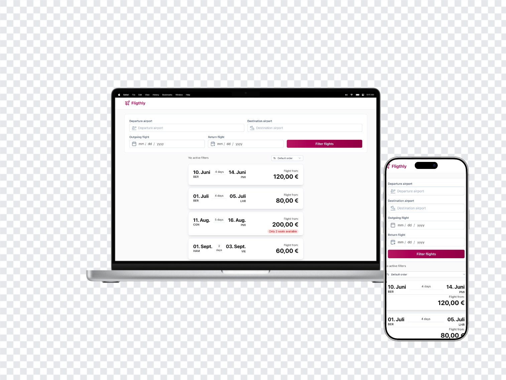

# ![Eurowings Digtial Logo][eurowings-digital-logo] Eurowings Digital Frontend Challenge

<!-- NOTE: made with https://app.screenhance.com/create?template=device-float -->



[](https://eurowings-digital-frontend-challenge.weimer.pro/)

This repository is structured as a working coding challenge submission and
demonstrates a small web application that consumes a mocked Flights API to
display flights with client-side filtering.

## 🧠 Approach

This challenge was used as an opportunity to explore newer tools in a practical
context while still delivering a complete solution. To support that, `Nuxt 4`
was selected to explore the latest Nuxt ecosystem in a real implementation.
With `Nuxt UI 4`, the focus stayed on functionality rather than building UI
primitives from scratch. `Tailwind CSS 4` complemented that setup by adding
hands-on experience with a widely adopted styling approach. Some design freedom
was also taken due to personal direction and the constraints of component-driven
UI, since reproducing a PDF reference 1:1 was not the main objective. For state
management, `Pinia` was intentionally skipped in favor of shareable URL-based
state, which fits filter-driven flows well. The interface was built mobile-first
and only expanded with breakpoints where they added clear value, while fluid
Flexbox layouts kept the UI responsive without brittle breakpoint-heavy CSS.

## 📋 Challenge Checklist

- [x] Create a simple mock HTTP endpoint returning static Flights JSON data
  - [x] Script for generating mocked data
  - [x] Serve the mocked data through an API
- [x] Build a mobile-first application that fetches and displays all flights
  - [x] Fetch flight data from the API
  - [x] Display all returned flights in a structured list
  - [x] Design a responsive layout from mobile screens up
  - [x] Show loading and error states while fetching data
- [x] Implement client-side filtering
  - [x] Add filter input form for origin, destination, departure date,
        and return date
  - [x] Apply selected filters to the displayed flight results
- [x] Ensure accessibility using semantic HTML and proper form labeling
- [x] Add basic automated tests for filtering logic and main component rendering
  - [x] Unit tests to validate core functionality and filtering logic
  - [x] Component tests to smoke-test basic rendering and key UI states
  - [x] End-to-end tests to verify the main user journey from data load to
        filtering results

## ✨ Extras

- [x] Flight results toolbar with active filters and sorting options
- [x] Empty-results handling with clear state and reset action
- [x] Mock data generation script for realistic Flight API
- [x] [Live demo](https://eurowings-digital-frontend-challenge.weimer.pro/) deployment

## 🧰 Tech Stack

![vue-typescript-nuxtjs-vite-nodejs-bun-tailwind-vitest-playwright-cloudflare][tech-stack-icons]

- `Vue 3`
- `TypeScript`
- `Nuxt 4`
- `Vite` (bundler)
- `Node.js` (runtime)
- `Bun` (scripts and package manager)
- `Tailwind CSS`
- `Vitest`
- `Playwright`
- `Cloudflare Pages`

## 🪄 Setup

> [!IMPORTANT]
> Requires Bun `≥ 1.3.9` and Node.js ≥ `24.13.1` installed.

### Install dependencies

```bash
bun install
```

### Generate mock data

```bash
bun run mockdata:flights
```

### Start local development

```bash
bun run dev
```

## 📜 Scripts

### Development server

Start the development server on `http://localhost:3000`:

```bash
bun run dev
```

### Production

Build the application for production:

```bash
bun run build
```

Locally preview production build:

```bash
bun run preview
```

Generate a static version of the app:

```bash
bun run generate
```

### Tests

Run the automated tests:

```bash
bun run test
```

Run tests in watch mode:

```bash
bun run test:watch
```

Run tests with coverage:

```bash
bun run test:coverage
```

Run end-to-end tests:

```bash
bun run test:e2e
```

Run end-to-end tests with Playwright UI mode:

```bash
bun run test:e2e:ui
```

### Mock data

Generate 50 mock Flight records using [Faker](https://fakerjs.dev/):

```bash
bun run mockdata:flights
```

> [!Note]
> This writes JSON to `data/flights.json`, which is returned by `GET /api/flights`.

<!-- NOTE: source: https://github.com/LelouchFR/skill-icons -->

[tech-stack-icons]: https://go-skill-icons.vercel.app/api/icons?i=vue,ts,nuxtjs,vite,nodejs,bun,tailwind,vitest,playwright,cloudflare
[eurowings-digital-logo]: https://eurowings-digital.de/ewd-logo-small.svg
